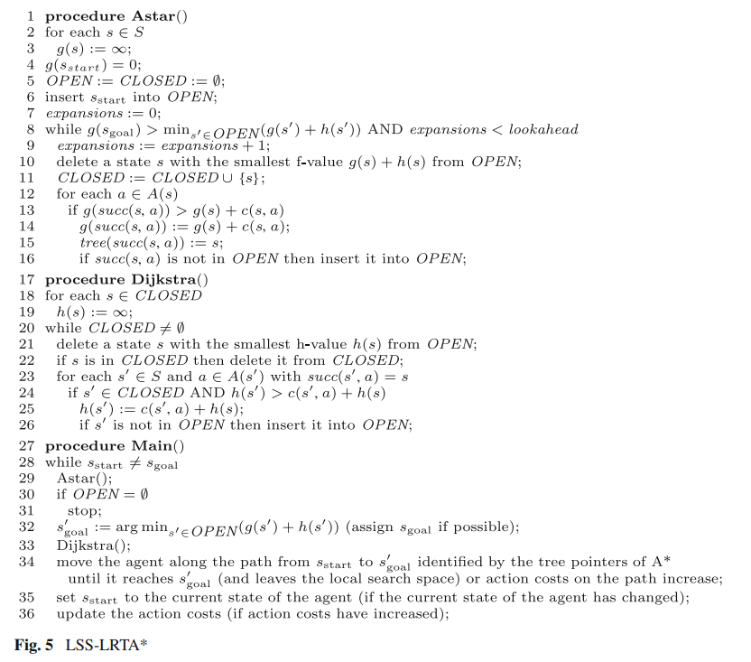

# D* lite vs LSS-LRTA*

## Incremental algorithm for path planning in a dynamic environment

### D* lite

The D* Lite algorithm was developed by Sven Koenig and Maxim Likhachev for a faster and easier alternative to the D* algorithm (developed by Anthony Stentz in 1995).  

Here is an implementation of D\*Lite as provided in the article in [Koenig, 2002](http://idm-lab.org/bib/abstracts/papers/aaai02b.pdf)

#### Main ideas
1. Сhange the direction of the search: now look for the path from goal to (current) start. If a change in edge cost is detected during traversal (around the current robot pose), only few nodes near the goal (=start) need to be updated.

2. Nodes that need to be updated, or the distance to them has changed, or was not calculated before. Then, it is clear that they must be updated in any case.  

3. Incremental heuristic search algorithms: able to focus and build upon previous solutions

#### Pseudo code, D* Lite optimized version

### LSS-LRTA*

The LSS-LRTA* is similar to the D*, but with a limitation to local processing (*lookahead*).
The current implementation was inspired as provided in the article in [S. Koenig, X. Sun, 2008](https://link.springer.com/content/pdf/10.1007/s10458-008-9061-x.pdf).

#### Main ideas
1. Use A* [13, 12] to search from the current state of agent toward the goal state until *lookahead* > 0 states have been  expanded or the goal state is about to be expanded. The states expanded by A* form the local search space.
2. Use Dijkstra's algorithm [8] to replace the h-values of all states in the local search space with the sum of the distance from the state to a state *s* and the *h-value* of state *s*, minimazed over all states *s* from *S* that border the local search space.
3. Move the agent along the path found by A* until it reaches the end of the path (and leaves the local search space) or action cost on the path increase.
4. If the current state of the agent is different from the goal state, then go to *Step 1*, oherwise terminate successfully.

#### Pseudo code, LSS-LRTA*

